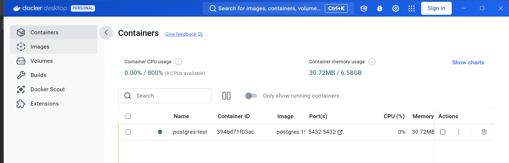
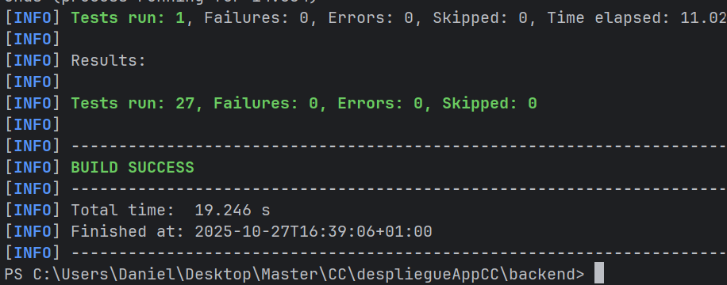
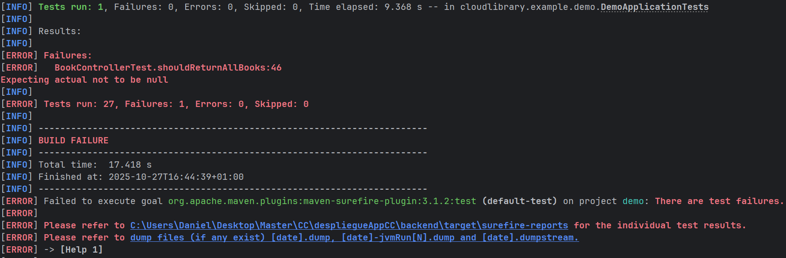
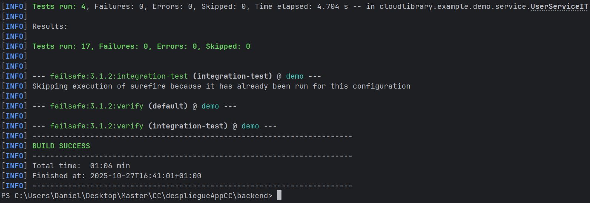
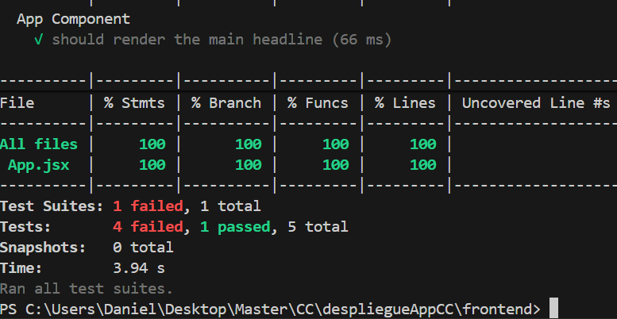
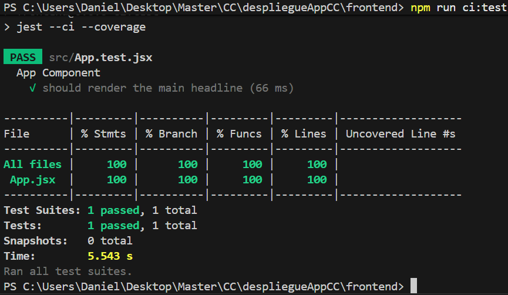
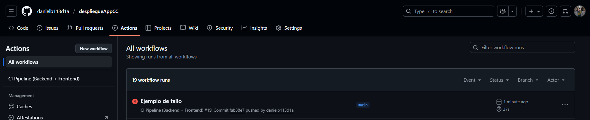
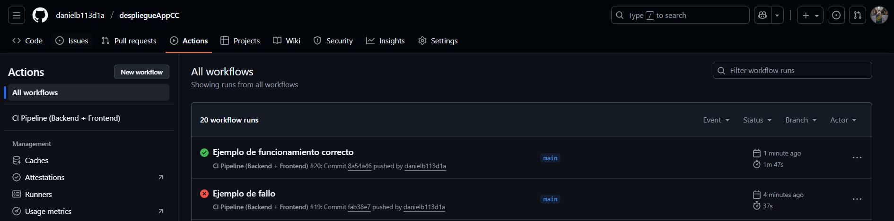

# Hito 3: Diseño de microservicios

## Justificación del Framework

Para el diseño e implementación del microservicio base de la aplicación, se ha seleccionado el framework **Spring Boot**, continuando con la pila tecnológica establecida en el Hito 2.

La elección de Spring Boot como pilar del backend se justifica por su idoneidad para la arquitectura de microservicios, basándose en las siguientes ventajas técnicas:

- **Servidor Embebido y Autocontención:** Spring Boot utiliza un servidor (Tomcat por defecto) embebido, lo que permite empaquetar la aplicación completa, con todas sus dependencias, en un único fichero `.jar` ejecutable. Esto es fundamental para la agilidad en el despliegue, la portabilidad y la contenedorización (Docker) que exige una arquitectura de microservicios.

- **Autoconfiguración (Convention over Configuration):** El framework reduce drásticamente la configuración "boilerplate" (plantilla). Al detectar dependencias en el `pom.xml` (como `spring-boot-starter-web` o `spring-boot-starter-data-jpa`), Spring Boot configura automáticamente los beans necesarios (DispatcherServlet, EntityManager, etc.), permitiendo al equipo centrarse en la lógica de negocio en lugar de en la infraestructura.

- **Ecosistema Estratégico (Spring Cloud):** Aunque en este hito solo se desarrolla un microservicio, la elección de Spring Boot es estratégica. Es la base del ecosistema Spring Cloud, que provee soluciones nativas y probadas para los patrones de diseño de microservicios más complejos, como Service Discovery (Eureka, Consul), Configuration Server o Circuit Breakers (Resilience4j).

- **Gestión de Dependencias Simplificada:** El sistema de `spring-boot-starter-*` agrupa dependencias comunes y gestiona sus versiones, asegurando la compatibilidad entre librerías (como Jackson, Hibernate, Spring Core) y evitando conflictos (`jar hell`).

- **Facilidad de Testing:** Como se demostró en el Hito 2, Spring Boot proporciona un soporte de primer nivel para la creación de tests unitarios y de integración. Utilidades como `@SpringBootTest`, `MockMvc` y la integración con Testcontainers facilitan la creación de pruebas exhaustivas que validan la funcionalidad del microservicio de forma aislada.

## Diseño de API, Rutas y Tests

Los objetivos de este hito se han fundamentado en un pilar central: un **diseño por capas** estricto que garantiza el desacoplamiento entre la lógica de la API (web) y la lógica de negocio. Para este proyecto, se ha implementado la arquitectura clásica de tres capas popularizada por Spring: **Controlador, Servicio y Repositorio**.

Este diseño no solo organiza el código, sino que define responsabilidades claras, siendo la clave para un sistema mantenible, escalable y, fundamentalmente, fácil de testear.

### Arquitectura por Capas y Desacoplamiento
La separación de responsabilidades es la siguiente:

1. **Capa de Controlador (API):**

    - **Componentes:** Clases anotadas con `@RestController`.

    - **Responsabilidad:** Es la única capa que "entiende" el protocolo HTTP. Se encarga exclusivamente de:

        - Mapear rutas (endpoints) (ej. `@GetMapping("/api/books")`).
        
        - Gestionar la serialización (Java a JSON) y deserialización (JSON a Java) de los cuerpos de las peticiones (`@RequestBody`).

        - Validar la entrada (ej. `@PathVariable`, `@RequestParam`).

        - Manejar los códigos de estado HTTP (ej. `ResponseEntity.ok()`, `ResponseEntity.notFound().build()`).

    - **Desacoplamiento:** Esta capa no contiene lógica de negocio. Sus métodos son deliberadamente simples, delegando inmediatamente todo el trabajo a la capa de Servicio.

2. **Capa de Servicio (Lógica de Negocio):**

    - **Componentes:** Clases anotadas con `@Service`.

    - **Responsabilidad:** Es el cerebro de la aplicación. Contiene todas las reglas de negocio y orquesta la lógica:

        - Implementa los casos de uso (ej. `registerUser`, `addPost`, `averageRatingForBook`).

        - Valida la lógica de negocio (ej. "un usuario no puede registrarse con un email duplicado").

        - Coordina múltiples repositorios si es necesario.

        - Define la gestión de transacciones (`@Transactional`).

    - **Desacoplamiento:** Esta capa es agnóstica al protocolo HTTP. No sabe nada de `ResponseEntity` o JSON. Recibe y devuelve objetos Java puros.

3. **Capa de Repositorio (Acceso a Datos):**

    - **Componentes:** Interfaces que extienden `JpaRepository` (`@Repository`).

    - **Responsabilidad:** Es la única capa que interactúa con la base de datos. Abstrae las consultas SQL.

    - **Desacoplamiento:** Los servicios no saben si la base de datos es PostgreSQL, H2 o MySQL; solo llaman a métodos Java (ej. `findById`, `save`).


### Diseño de la API y Gestión de Rutas

El diseño de la API sigue los principios RESTful, centrándose en recursos. Las rutas se han diseñado de forma coherente y predecible:

- **Basadas en Recursos:** Los endpoints se agrupan por la entidad que gestionan (ej. `/api/books`, `/api/users`, `/api/posts`).

- **Verbos HTTP Estándar:** Se utiliza el verbo HTTP adecuado para cada acción (CRUD):
    - `GET`: Para obtener recursos (listas o por ID).

    - `POST`: Para crear nuevos recursos.

    - `PUT`: Para actualizar recursos existentes (aunque en esta implementación se usa para lógica específica).

    - `DELETE`: Para eliminar recursos.

- **Rutas Anidadas:** Para expresar relaciones, se usan rutas anidadas, como:

    - `GET /api/comments/post/{postId}`: Obtiene comentarios para un post.

    - `GET /api/books/{id}/average-rating`: Obtiene la media de un libro.


### Estrategia de Pruebas (Tests)

Para validar la correcta implementación de estas capas, se ha utilizado una estrategia de pruebas multinivel.

#### Tests Unitarios

Se centran en probar la lógica de negocio de la capa de Servicio en aislamiento, usando mocks (`@MockBean`) para simular la capa de repositorio. Esto valida las reglas de negocio puras (ej. "el promedio de [5, 3] es 4.0") sin depender de HTTP o una BBDD.

#### Tests de Integración de API (`...ControllerIT.java`)

Esta ha sido la parte fundamental de este hito. El objetivo es testear la API de forma exhaustiva, validando la integración de todas las capas (desde el HTTP hasta la BBDD) y la configuración de seguridad.

- **Herramienta:** Se ha utilizado `MockMvc` del framework Spring Test. `MockMvc` simula peticiones HTTP al dispatcher servlet de Spring sin necesidad de levantar un servidor web real, ofreciendo un equilibrio perfecto entre realismo y velocidad.

- **Alcance:** Estos tests validan el flujo completo:

  1. **Rutas:** Comprueban que `GET /api/books/1` se mapea al método correcto.

  2. **Serialización:** Verifican que la API devuelve JSON válido (`.andExpect(jsonPath("$.title", is(...)))`).

  3. **Códigos de Estado:** Confirman las respuestas HTTP (`.andExpect(status().isOk())`, `.isNotFound()`, `.isCreated()`).

  4. **Integración con BBDD:** Al usar `@SpringBootTest` con `@ActiveProfiles("test")`, los tests se ejecutan contra una base de datos H2 en memoria, asegurando que las consultas de los repositorios son correctas.

  5. **Lógica de Negocio:** Prueban los casos de uso de extremo a extremo (ej. `shouldGetAverageRating_WhenRatingsExist` valida que la media calculada es correcta).

- **Integración con Spring Security:** Un aspecto clave ha sido probar la API con la seguridad activada. Para ello, se ha utilizado la librería `spring-security-test`, que permite simular usuarios autenticados:

    - Para endpoints protegidos (la mayoría de `GET`, `POST`, `DELETE`), las peticiones se "firman" con `.with(user(...))` y `.with(csrf())`.

    - Para endpoints públicos (`/api/users/register`, `/api/users/login`), se ha validado que fallan con 401 (Unauthorized) si no se configuran como `permitAll()` en `SecurityConfig`, y que funcionan correctamente sin autenticación una vez configurados.

Este enfoque de testing de API garantiza que la lógica de negocio (Servicio) está correctamente expuesta y protegida por la capa web (Controlador) y que ambos interactúan correctamente con la capa de datos (Repositorio).


## Sistema de Logs

### 1️⃣ Backend — Java (Spring Boot)

**Opciones principales:**

- JUnit 5 (Jupiter)  
- TestNG  
- Spock (Groovy)  

**Opcion seleccionada:** JUnit 5 (Jupiter)

### Justificación

- **Estándar de facto en Java/Spring Boot:** la documentación oficial de Spring Boot y la mayoría de starters usan JUnit 5. Esto asegura compatibilidad con plugins de Maven y CI.

- **Test runner robusto y flexible:** encuentra y ejecuta automáticamente tests anotados con `@Test`, `@ParameterizedTest`, etc., y genera informes de ejecución claros.

- **Integración con bibliotecas de aserciones externas:** se integra sin problemas con AssertJ, que hemos elegido como biblioteca de aserciones.

- **Herramientas de línea de comandos:** mediante Maven (`mvn test` o `mvn verify`) permite ejecutar todos los tests en local o CI de manera reproducible.

- **Extensible:** soporta extensiones y configuraciones avanzadas (por ejemplo, `@SpringBootTest`, `@DataJpaTest`, pruebas con perfiles de Spring).


### Integración con CI

- Compatible con GitHub Actions.  
- Los resultados de tests se pueden exportar a XML/HTML para reportes automáticos.

---

### 2️⃣ Frontend — React (JavaScript)

**Opciones principales:**

- Jest (con CLI)  
- Mocha + Chai  
- Vitest (si se usa Vite)  

**Opcion seleccionada:** Jest

### Justificación

- **Integración directa con Create React App y Vite:** viene preconfigurado y listo para ejecutar tests unitarios de componentes y lógica JS.

- **Test runner + assertions:** aunque Jest incluye `expect`, se puede combinar con Testing Library para aserciones más específicas de DOM.

- **Herramienta de línea de comandos:** `npm test` o `npm run ci:test` permite ejecutar todos los tests, generar cobertura y exportar resultados para CI.

- **Flexibilidad:** permite mocks, tests asincrónicos, pruebas parametrizadas, snapshots, y es ampliamente adoptado en la comunidad React.

- **Estilo BDD:** con `describe` e `it`, permite estructurar los tests de manera legible y orientada al comportamiento esperado.


## Correcta Ejecución de Tests

Para garantizar que los tests se ejecuten de forma uniforme, reproducible y automatizada tanto en local como en el entorno de integración continua (CI), se han integrado dentro de las herramientas de construcción estándar de cada entorno.
Además, se ha implementado una orquestación global mediante Makefiles que permite lanzar todas las pruebas del proyecto —tanto backend como frontend— desde la raíz del repositorio.

### Backend (Spring Boot / Maven)

En el backend, desarrollado con Java Spring Boot, las pruebas se integran mediante Maven, utilizando sus plugins nativos:

- `maven-surefire-plugin` → ejecución de tests unitarios.

- `maven-failsafe-plugin` → ejecución de tests de integración.

Esta estructura asegura que cualquier desarrollador o entorno CI ejecute las pruebas con los mismos comandos y configuraciones, sin dependencias externas ni scripts adicionales.

Para simplificar la ejecución, se ha definido un **Makefile dentro del directorio backend/**, que permite ejecutar los tests mediante tareas predefinidas:

```makefile
.PHONY: test unit integration clean

# Clave: diferencia entre Linux y Windows
# Linux → MVNW = ./mvnw
# Windows → MVNW = mvnw
MVNW = ./mvnw

# 'MVN_ARGS' se pasa desde el Makefile raíz
MVN_ARGS ?=

clean:
	$(MVNW) clean

unit:
	@echo "=== Ejecutando tests unitarios (Surefire) ==="
	$(MVNW) test $(MVN_ARGS)

integration:
	@echo "=== Ejecutando tests de integración (Failsafe) ==="
	$(MVNW) verify -DskipUnitTests=true $(MVN_ARGS)

test:
	@echo "=== Ejecutando todos los tests (unit + integration) ==="
	$(MVNW) clean verify $(MVN_ARGS)
```

Con esto, desde el directorio del backend se pueden ejecutar fácilmente:

```bash
# Todos los tests (unitarios + integración)
make test

# Solo unitarios
make unit

# Solo integración
make integration
```

### Frontend (React / npm)

En el frontend, basado en React, las pruebas se ejecutan mediante npm scripts, definidos en el archivo package.json:

```json
"scripts": {
  "test": "react-scripts test",
  "ci:test": "react-scripts test --watchAll=false"
}
```

Esto permite ejecutar las pruebas de manera reproducible tanto en local como en CI mediante:

```bash
# Instalar dependencias de forma limpia
npm ci

# Ejecutar los tests en modo no interactivo
npm run ci:test
```

El entorno del frontend no depende del backend ni de la base de datos (PostgreSQL), por lo que las pruebas se centran exclusivamente en la lógica de componentes y comportamiento del UI.

### Orquestación general — Makefile

En la raíz del proyecto se ha implementado un Makefile principal que actúa como punto de entrada unificado para la ejecución de todos los tests del sistema.
Este Makefile se encarga de invocar los tests del backend y frontend, gestionando correctamente los entornos y argumentos necesarios para cada uno.

```makefile
.PHONY: backend-test frontend-test test

# Opciones de Maven para CI (Batch mode y perfil de test)
BACKEND_CI_ARGS = -B -Dspring.profiles.active=test

backend-test:
	@echo "--- Ejecutando Tests del Backend (via nested Make) ---"
	cd backend && make test MVN_ARGS="$(BACKEND_CI_ARGS)"

frontend-test:
	@echo "--- Ejecutando Tests del Frontend (Jest) ---"
	cd frontend && npm ci && npm run ci:test

test: backend-test frontend-test
	@echo "--- Pipeline de CI completado ---"
```

De esta forma, desde la raíz del repositorio, la ejecución completa de todos los tests (backend y frontend) se reduce a un solo comando:

```bash
make test
```

Esto permite que tanto los desarrolladores en local como el sistema de integración continua (por ejemplo, GitHub Actions) ejecuten exactamente los mismos comandos, garantizando consistencia, trazabilidad y simplicidad en todo el flujo de testing.

## Elección y configuración de un sistema de integración continua (CI)

Para este proyecto se ha configurado un sistema de Integración Continua (CI) que automatiza la ejecución de tests y validaciones de código cada vez que se realiza un push o se abre un pull request en GitHub.

Entre las opciones más comunes **(GitHub Actions, Jenkins, Travis CI o CircleCI)** se ha optado por GitHub Actions, debido a su integración nativa con GitHub, flexibilidad y gratuidad para repositorios públicos.
Se ha decidido utilizar **GitHub Actions**, por las siguientes razones:

- **Integración nativa con GitHub:** se activa automáticamente al hacer un push o abrir un pull request, sin necesidad de configuraciones externas complejas.

- **Gratuito para repositorios públicos:** permite configurar pipelines completos sin coste adicional.

- **Flexibilidad y compatibilidad:** permite ejecutar comandos de backend (Maven) y frontend (npm), levantar servicios como PostgreSQL para pruebas de integración, y generar informes de tests y cobertura.

- **Automatización completa:** garantiza que todos los cambios en el repositorio sean probados automáticamente, asegurando calidad de código antes de cualquier despliegue.

### Flujo de CI configurado

Cada vez que se realiza un push o pull request, se ejecutan las siguientes etapas:

1. Configuración del entorno: instalación de dependencias necesarias (Java, Node.js, PostgreSQL).
2. Instalación del backend: descarga de dependencias Maven y compilación del proyecto.
3. Instalación del frontend: instalación de dependencias npm y ejecución de tests.
4. Ejecución de pruebas automáticas:
    -  Tests unitarios y de integración en el backend (JUnit + AssertJ).
    - Tests de componentes y UI en el frontend (Jest + Testing Library).
5. Generación de reportes de test: resultados exportados automáticamente para revisión.

De esta manera, cada push al repositorio activa el pipeline de GitHub Actions y ejecuta todos los tests de manera consistente y reproducible.

### Configuración del pipeline en GitHub Actions

El flujo completo se define en el archivo `.github/workflows/ci.yml` en la raíz del repositorio:

```yml
name: CI Pipeline (Backend + Frontend)

# Se activa en cada 'push' a la rama 'main'
# y en cada Pull Request que apunte a 'main'
on:
  push:
    branches: [ main ]
  pull_request:
    branches: [ main ]

jobs:
  build-and-test:
    name: Build & Test
    runs-on: ubuntu-latest 

    # Levanta un contenedor de PostgreSQL para los tests
    # de integración del backend
    services:
      postgres:
        image: postgres:15-alpine
        env:
          POSTGRES_USER: test
          POSTGRES_PASSWORD: test
          POSTGRES_DB: testdb
        ports:
          - 5432:5432 # Mapea el puerto del contenedor al host
        # Opción de salud para esperar a que la BBDD esté lista
        options: >-
          --health-cmd="pg_isready -U test"
          --health-interval=10s
          --health-timeout=5s
          --health-retries=5

    steps:
      # Descarga tu código
      - name: Checkout repository
        uses: actions/checkout@v4

      # Configura Java (para el Backend)
      - name: Set up JDK 21
        uses: actions/setup-java@v4
        with:
          java-version: '21'
          distribution: 'temurin'

      # Configura Node.js (para el Frontend)
      - name: Set up Node.js
        uses: actions/setup-node@v4
        with:
          node-version: '18' # O la versión que estés usando
          cache: 'npm' # Habilita la caché para 'npm ci'
          cache-dependency-path: frontend/package-lock.json
      
      - name: Add execute permission to mvnw
        run: chmod +x backend/mvnw
          
      - name: Run all tests (via root Makefile)
        run: make test
    
      - name: Upload Test Reports
        if: always()
        uses: actions/upload-artifact@v4
        with:
          name: test-reports
          path: |
            backend/target/surefire-reports/
            backend/target/failsafe-reports/
```

## Resumen rápido de herramientas y configuraciones de testing

### Backend (Java / Spring Boot)
- **Test runner:** JUnit 5 (Jupiter)  
- **Biblioteca de aserciones:** AssertJ (estilo BDD)  
- **Ejecución de tests:** Maven (`mvn test` / `mvn verify`)  
- **Plugins:** `maven-surefire` para unit tests, `maven-failsafe` para integration tests  
- **Integración CI:** GitHub Actions  
- **Base de datos de prueba:** PostgreSQL (contenedor durante tests de integración)

### Frontend (React / JavaScript)
- **Test runner:** Jest  
- **Aserciones / testing DOM:** Jest + Testing Library  
- **Ejecución de tests:** npm scripts (`npm ci`, `npm run ci:test`)  
- **Estilo de tests:** BDD (`describe` / `it`)  
- **Integración CI:** GitHub Actions

### Orquestación general
- **Makefile:** objetivo `make test` para ejecutar backend y frontend en un solo comando  

### Integración continua (CI)
- **Plataforma:** GitHub Actions  
- **Flujo CI:** Configuración del entorno, instalación del backend, instalación del frontend, ejecución de pruebas automáticas y generación de reportes de test

## Tests implementados

### Unitarios

#### Tecnologías y palabras clave usadas

- JUnit 5 (`@Test`, `@BeforeEach`, `Assertions`)
  - `@Test`: indica que el método es un test.
  - `@BeforeEach`: se ejecuta antes de cada test para inicializar objetos comunes.
  - `Assertions o assertThat`: para validar resultados esperados.

- Mockito (`@Mock`, `@InjectMocks`, `when`, `verify`, `doNothing`)
  - `@Mock`: crea un mock de un servicio o dependencia. Un mock es un objeto simulado que imita el comportamiento de un objeto real que tu código necesita, pero que no quieres ejecutar realmente durante el test.
    - Se usa para aislar el componente que estás probando y evitar dependencias externas.
    - Permite definir respuestas controladas a llamadas de métodos.
    - También permite verificar interacciones, es decir, comprobar que ciertos métodos se llamaron correctamente.
  - `@InjectMocks`: inyecta los mocks dentro del objeto que queremos probar (el controlador).
  - `when(...).thenReturn(...)`: define el comportamiento esperado de un mock.
  - `verify(..., times(n))`: verifica que un método del mock fue llamado n veces.
  - `doNothing().when(...)`: simula métodos void que no devuelven nada.
  - `any(), eq()`: matchers para parámetros de métodos mockeados.

- Spring Boot / ResponseEntity
  - Se testea la respuesta HTTP devuelta por los controladores (`ResponseEntity`).
  - Se comprueba el status code (`is2xxSuccessful()`, `is4xxClientError()`) y el contenido (`getBody()`).

#### Listado de tests unitarios implementados

| BookControllerTest | CategoryControllerTest | CommentControllerTest |
|-------------------|----------------------|---------------------|
| shouldReturnAllBooks | shouldGetAllCategories | shouldGetCommentsByPost |
| shouldReturnBookById | shouldGetCategoryById | shouldAddComment |
| shouldAddNewBook | shouldReturnNotFoundForInvalidId | shouldAddReplyToComment |
| shouldDeleteBook | shouldCreateCategory | shouldDeleteComment |
|                   | shouldUpdateCategory |                     |
|                   | shouldDeleteCategory |                     |

| PostControllerTest | RatingControllerTest | UserControllerTest |
|-------------------|--------------------|------------------|
| shouldGetAllPosts | shouldGetRatingsByBook | shouldRegisterNewUser |
| shouldGetPostById | shouldAddRating       | shouldNotRegisterDuplicateEmail |
| shouldReturnNotFoundForInvalidPostId | shouldDeleteRating | shouldReturnUserProfile |
| shouldAddPost     |                      | shouldAuthenticateUser |
| shouldDeletePost  |                      |                       |

#### Ejemplo detallado de un test unitario

Vamos a analizar BookControllerTest.shouldReturnBookById como ejemplo de test unitario:

```java
@Test
void shouldReturnBookById() {
    // 1️⃣ Configuración (Arrange)
    when(bookService.findBookById(1L)).thenReturn(Optional.of(testBook));

    // 2️⃣ Ejecución (Act)
    ResponseEntity<Book> response = bookController.getBookById(1L);

    // 3️⃣ Verificación (Assert)
    assertThat(response).isNotNull(); // La respuesta no debe ser null
    assertThat(response.getStatusCode().is2xxSuccessful()).isTrue(); // Debe ser código 200
    assertThat(response.getBody()).isEqualTo(testBook); // El cuerpo debe ser igual al libro esperado

    // 4️⃣ Comprobación de interacción con el mock
    verify(bookService, times(1)).findBookById(1L);
}

```

Explicación:

1. **Arrange:**
Se configura el mock `bookService` para que devuelva un `Optional` con `testBook` cuando se llame a `findBookById(1L)`.

2. **Act:**
Se llama al método real del controlador `getBookById(1L)` y se guarda la respuesta en `ResponseEntity<Book>`.

3. **Assert:**
    - Se valida que la respuesta no sea `null`.
    - Se comprueba que el `status code` sea exitoso (`2xx`).
    - Se asegura que el cuerpo de la respuesta sea el `testBook` esperado.

4. **Verify:**
   - Se verifica que `bookService.findBookById(1L)` se haya llamado exactamente una vez, asegurando la interacción con la dependencia.


### Integración

#### Tecnologías y anotaciones principales

- `@SpringBootTest`:	Levanta el contexto completo de Spring Boot (Beans reales, repositorios, servicios, etc.).
- `@Testcontainers`:	Indica que se usan contenedores Docker de prueba gestionados por Testcontainers.
- `PostgreSQLContainer`:	Crea una base de datos PostgreSQL real y efímera (aislada por cada suite de tests).
- `@Autowired`:	Inyecta beans reales del contexto de Spring: servicios y repositorios.
- `@BeforeEach`:	Limpia las tablas antes de cada test (deleteAll()), garantizando independencia entre pruebas.
- `@Transactional`:	asegura rollback automático tras cada test.
- `assertThat` / `assertThrows`:	De AssertJ y JUnit para validar los resultados y excepciones esperadas.

#### Listado de tests integrales implementados

| BookServiceIT                         | CategoryServiceIT                        | CommentServiceIT        |
| ------------------------------------- | ---------------------------------------- | ----------------------- |
| shouldSaveBook                        | shouldCreateCategory                     | shouldAddReplyToComment |
| shouldFindAllBooks                    | shouldThrowWhenCreatingDuplicateCategory | shouldGetCommentsByPost |
| shouldFindBookById                    | shouldUpdateCategory                     |                         |
| shouldReturnEmptyOptionalForInvalidId |                                          |                         |
| shouldDeleteBook                      |                                          |                         |

| PostServiceIT                       | RatingServiceIT                             | UserServiceIT                   |
| ----------------------------------- | ------------------------------------------- | ------------------------------- |
| shouldSavePostAndNewBookWithCascade | shouldCalculateAverageRatingForBook         | shouldRegisterNewUser           |
|                                     | shouldReturnNullAverageForBookWithNoRatings | shouldNotRegisterDuplicateEmail |
|                                     |                                             | shouldReturnUserProfile         |
|                                     |                                             | shouldAuthenticateUser          |

#### Ejemplo detallado de un test integral

Vamos a analizar RatingServiceIT.shouldCalculateAverageRatingForBook() como ejemplo de test unitario:

```java
@Test
void shouldCalculateAverageRatingForBook() {
    // 1️⃣ Arrange
    Rating r1 = new Rating();
    r1.setBook(testBook);
    r1.setUser(testUser);
    r1.setValue(5);
    ratingService.addRating(r1);

    Rating r2 = new Rating();
    r2.setBook(testBook);
    r2.setUser(testUser);
    r2.setValue(4);
    ratingService.addRating(r2);

    Rating r3 = new Rating();
    r3.setBook(testBook);
    r3.setUser(testUser);
    r3.setValue(3);
    ratingService.addRating(r3);

    // 2️⃣ Act
    Double average = ratingService.averageRatingForBook(testBook.getId());

    // 3️⃣ Assert
    assertThat(average).isEqualTo(4.0);
}
```

Explicación:

1. **Arrange:** Inserta tres valoraciones reales en la BD PostgreSQL de Testcontainers.

2. **Act:** Llama al método real averageRatingForBook(), que ejecuta una query real a la BD.

3. **Assert:** Comprueba que el promedio calculado (4.0) coincide con el esperado.


## Funcionamiento en mi máquina


### Funcionamiento actual de Docker:

Para poder realizar la práctica y no tener que descargar ninguna base de datos, se ha creado un contenedor de docker que corre la base de datos que se va a usar, quedando de la siguiente manera:



### Funcionamiento de tests unitarios:

#### Test unitario fallido


#### Test unitario exitoso


### Funcionamiento de tests integración:

#### Test de integración fallido


#### Test de integración exitoso


### Funcionamiento de tests de frontend:

#### Test de frontend fallido


#### Test de frontend exitoso


### Funcionamiento de GitHub Actions:

#### GitHub Actions fallido


#### GitHub Actions exitoso



