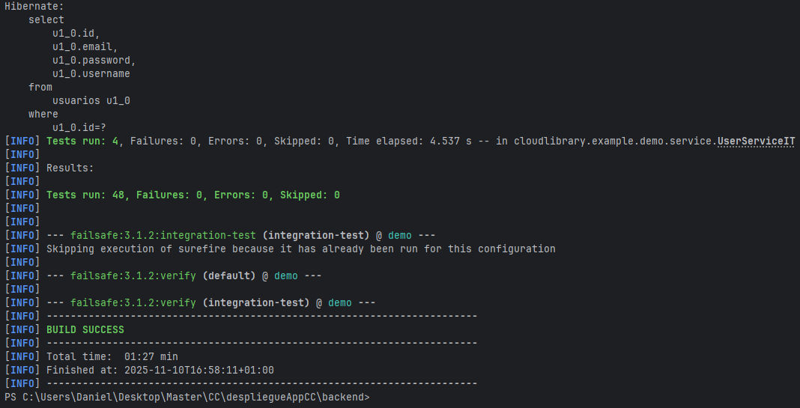
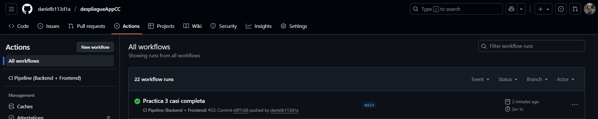

# Hito 3: Diseño de microservicios

## Justificación del Framework

Para el diseño e implementación del microservicio base de la aplicación, se ha seleccionado el framework **Spring Boot**, continuando con la pila tecnológica establecida en el Hito 2.

La elección de Spring Boot como nucleo del backend se justifica por su idoneidad para la arquitectura de microservicios, basándose en las siguientes ventajas técnicas:

- **Servidor Embebido y Autocontención:** Spring Boot utiliza un servidor (Tomcat por defecto) embebido, lo que permite empaquetar la aplicación completa, con todas sus dependencias, en un único fichero `.jar` ejecutable. Esto es fundamental para la agilidad en el despliegue, la portabilidad y la contenedorización (Docker) que exige una arquitectura de microservicios.

- **Autoconfiguración (Convention over Configuration):** Al detectar dependencias en el `pom.xml` (como `spring-boot-starter-web` o `spring-boot-starter-data-jpa`), Spring Boot configura automáticamente los beans necesarios (DispatcherServlet, EntityManager, etc.), permitiendo al equipo centrarse en la lógica de negocio en lugar de en la infraestructura.

- **Ecosistema Estratégico (Spring Cloud):** Aunque en este hito solo se desarrolla un microservicio, la elección de Spring Boot es estratégica. Es la base del ecosistema Spring Cloud, que provee soluciones nativas y probadas para los patrones de diseño de microservicios más complejos, como Service Discovery (Eureka, Consul), Configuration Server o Circuit Breakers (Resilience4j).

- **Gestión de Dependencias Simplificada:** El sistema de `spring-boot-starter-*` agrupa dependencias comunes y gestiona sus versiones, asegurando la compatibilidad entre librerías (como Jackson, Hibernate, Spring Core) y evitando conflictos.

- **Facilidad de Testing:** Como se demostró en el Hito 2, Spring Boot proporciona un soporte de primer nivel para la creación de tests unitarios y de integración. Utilidades como `@SpringBootTest`, `MockMvc` y la integración con Testcontainers facilitan la creación de pruebas exhaustivas que validan la funcionalidad del microservicio de forma aislada.

## Diseño de API, Rutas y Tests

Los objetivos de este hito se han fundamentado un **diseño por capas** estricto que garantiza el desacoplamiento entre la lógica de la API (web) y la lógica de negocio. Para este proyecto, se ha implementado la arquitectura clásica de tres capas popularizada por Spring: **Controlador, Servicio y Repositorio**.

Este diseño no solo organiza el código, sino que define responsabilidades claras, siendo la clave para un sistema mantenible, escalable y, fundamentalmente, fácil de testear.

### Arquitectura por Capas y Desacoplamiento
La separación de responsabilidades es la siguiente:

1. **Capa de Controlador (API):**

    - **Componentes:** Clases anotadas con `@RestController`.

    - **Responsabilidad:** Es la única capa que "entiende" el protocolo HTTP. Se encarga exclusivamente de:

        - Mapear rutas (endpoints) (ej. `@GetMapping("/api/books")`).
        
        - Gestionar la serialización (Java a JSON) y deserialización (JSON a Java) de los cuerpos de las peticiones (`@RequestBody`).

        - Validar la entrada (ej. `@PathVariable`, `@RequestParam`).

        - Manejar los códigos de estado HTTP (ej. `ResponseEntity.ok()`, `ResponseEntity.notFound().build()`).

    - **Desacoplamiento:** Esta capa no contiene lógica de negocio. Sus métodos son deliberadamente simples, delegando inmediatamente todo el trabajo a la capa de Servicio.

2. **Capa de Servicio (Lógica de Negocio):**

    - **Componentes:** Clases anotadas con `@Service`.

    - **Responsabilidad:** Es el cerebro de la aplicación. Contiene todas las reglas de negocio y orquesta la lógica:

        - Implementa los casos de uso (ej. `registerUser`, `addPost`, `averageRatingForBook`).

        - Valida la lógica de negocio (ej. "un usuario no puede registrarse con un email duplicado").

        - Coordina múltiples repositorios si es necesario.

        - Define la gestión de transacciones (`@Transactional`).

    - **Desacoplamiento:** Esta capa es agnóstica al protocolo HTTP. No sabe nada de `ResponseEntity` o JSON. Recibe y devuelve objetos Java puros.

3. **Capa de Repositorio (Acceso a Datos):**

    - **Componentes:** Interfaces que extienden `JpaRepository` (`@Repository`).

    - **Responsabilidad:** Es la única capa que interactúa con la base de datos. Abstrae las consultas SQL.

    - **Desacoplamiento:** Los servicios no saben si la base de datos es PostgreSQL, H2 o MySQL; solo llaman a métodos Java (ej. `findById`, `save`).


### Diseño de la API y Gestión de Rutas

El diseño de la API sigue los principios RESTful, centrándose en recursos. Las rutas se han diseñado de forma coherente y predecible:

- **Basadas en Recursos:** Los endpoints se agrupan por la entidad que gestionan (ej. `/api/books`, `/api/users`, `/api/posts`).

- **Verbos HTTP Estándar:** Se utiliza el verbo HTTP adecuado para cada acción (CRUD):
    - `GET`: Para obtener recursos (listas o por ID).

    - `POST`: Para crear nuevos recursos.

    - `PUT`: Para actualizar recursos existentes (aunque en esta implementación se usa para lógica específica).

    - `DELETE`: Para eliminar recursos.

- **Rutas Anidadas:** Para expresar relaciones, se usan rutas anidadas, como:

    - `GET /api/comments/post/{postId}`: Obtiene comentarios para un post.

    - `GET /api/books/{id}/average-rating`: Obtiene la media de un libro.


### Estrategia de Pruebas (Tests)

Para validar la correcta implementación de estas capas, se ha utilizado una estrategia de pruebas multinivel.

#### Tests Unitarios

Se centran en probar la lógica de negocio de la capa de Servicio en aislamiento, usando mocks (`@MockBean`) para simular la capa de repositorio. Esto valida las reglas de negocio puras (ej. "el promedio de [5, 3] es 4.0") sin depender de HTTP o una BBDD.

#### Tests de Integración de API (`...ControllerIT.java`)

Esta ha sido la parte fundamental de este hito. El objetivo es testear la API de forma exhaustiva, validando la integración de todas las capas (desde el HTTP hasta la BBDD) y la configuración de seguridad.

- **Herramienta:** Se ha utilizado `MockMvc` del framework Spring Test. `MockMvc` simula peticiones HTTP al dispatcher servlet de Spring sin necesidad de levantar un servidor web real, ofreciendo un equilibrio perfecto entre realismo y velocidad.

- **Alcance:** Estos tests validan el flujo completo:

  1. **Rutas:** Comprueban que `GET /api/books/1` se mapea al método correcto.

  2. **Serialización:** Verifican que la API devuelve JSON válido (`.andExpect(jsonPath("$.title", is(...)))`).

  3. **Códigos de Estado:** Confirman las respuestas HTTP (`.andExpect(status().isOk())`, `.isNotFound()`, `.isCreated()`).

  4. **Integración con BBDD:** Al usar `@SpringBootTest` con `@ActiveProfiles("test")`, los tests se ejecutan contra una base de datos H2 en memoria, asegurando que las consultas de los repositorios son correctas.

  5. **Lógica de Negocio:** Prueban los casos de uso de extremo a extremo (ej. `shouldGetAverageRating_WhenRatingsExist` valida que la media calculada es correcta).

- **Integración con Spring Security:** Un aspecto clave ha sido probar la API con la seguridad activada. Para ello, se ha utilizado la librería `spring-security-test`, que permite simular usuarios autenticados:

    - Para endpoints protegidos (la mayoría de `GET`, `POST`, `DELETE`), las peticiones se "firman" con `.with(user(...))` y `.with(csrf())`.

    - Para endpoints públicos (`/api/users/register`, `/api/users/login`), se ha validado que fallan con 401 (Unauthorized) si no se configuran como `permitAll()` en `SecurityConfig`, y que funcionan correctamente sin autenticación una vez configurados.

Este enfoque de testing de API garantiza que la lógica de negocio (Servicio) está correctamente expuesta y protegida por la capa web (Controlador) y que ambos interactúan correctamente con la capa de datos (Repositorio).


## Sistema de Registro de Actividad (Logs)

Para poder tener una aplicación lo más completa posible para que sea desplegada, se ha implementado un **Sistema de Registro de Actividad (logs)** descrito a continuación,

### Justificación del Framework (SLF4J + Logback)

Para este proyecto, se ha optado por utilizar la pila de logging estándar proporcionada por Spring Boot: **SLF4J (Simple Logging Facade for Java)** como fachada de API y **Logback** como implementación nativa.

La justificación de esta elección se basa en varios puntos clave:

- **Estándar del lenguaje:** SLF4J es la fachada de logging de facto en el ecosistema Java. Permite que el código de nuestra aplicación (controladores, servicios) dependa únicamente de una abstracción (`org.slf4j.Logger`) y no de una implementación concreta.

- **Desacoplamiento:** Gracias a SLF4J, podríamos cambiar la implementación de logging subyacente (por ejemplo, de Logback a Log4j2) en el futuro, simplemente cambiando una dependencia en `pom.xml`, sin necesidad de modificar una sola línea de nuestro código fuente.

- **Integración Nativa:** `spring-boot-starter-web` incluye `spring-boot-starter-logging` como dependencia transitiva, por lo que Logback viene configurado por defecto. Esto elimina la necesidad de configuración inicial y asegura una compatibilidad total con el ecosistema de Spring.

- **Rendimiento y Flexibilidad:** Logback es el sucesor moderno de Log4j, conocido por su alto rendimiento, bajo consumo de memoria y potentes opciones de configuración (como la rotación de ficheros, que veremos más adelante).

### Implementación del Registro

El logging se ha implementado en tres niveles estratégicos para garantizar una cobertura completa de la actividad de la aplicación.

**1. Registro de Actividad de la API (Controladores)**

Para cumplir con el requisito de "registrar la actividad de la API", se ha añadido un `Logger` a cada clase `@RestController`. Esto nos proporciona un rastro inmediato de cada petición HTTP que recibe el microservicio.

- Se utiliza `log.info()` para registrar las peticiones exitosas (el "camino feliz"), incluyendo el método HTTP, la ruta y los parámetros clave.

- Se usan placeholders (`{}`) para la inserción de variables, lo que optimiza el rendimiento al evitar la concatenación de String si el nivel de log está desactivado.

```Java

// Ejemplo en UserController.java

import org.slf4j.Logger;
import org.slf4j.LoggerFactory;

@RestController
@RequestMapping("/api/users")
public class UserController {

    private static final Logger log = LoggerFactory.getLogger(UserController.class);
    // ...

    @PostMapping("/register")
    public ResponseEntity<User> registerUser(@RequestBody User user) {
        // Logueamos la intención, no datos sensibles
        log.info("Request POST /api/users/register - Intento de registro para el email: {}", user.getEmail());
        
        try {
            User saved = userService.registerUser(user);
            log.info("Usuario registrado exitosamente con ID: {}", saved.getId());
            return ResponseEntity.status(HttpStatus.CREATED).body(saved);
        } catch (IllegalArgumentException e) {
            log.warn("Intento de registro fallido (email duplicado): {}", user.getEmail());
            return ResponseEntity.status(HttpStatus.CONFLICT).build();
        }
    }

    @GetMapping("/{id}")
    public ResponseEntity<User> getProfile(@PathVariable Long id) {
        log.info("Request GET /api/users/{} - Solicitando perfil de usuario", id);
        User profile = userService.getProfile(id);
        return ResponseEntity.ok(profile);
    }
}
```

**2. Gestión Centralizada de Errores (GlobalExceptionHandler)**

Un buen sistema de logging no solo registra el éxito, sino también el fracaso. Para evitar código `try-catch` repetitivo en los controladores, se ha implementado un **Manejador de Excepciones Global** (`@ControllerAdvice`).

Esta clase centraliza la captura de excepciones, las traduce a respuestas HTTP coherentes (como 404 o 500) y, lo más importante, registra el error con el nivel de severidad adecuado:

- `log.warn()` **(Advertencia)**: Se utiliza para errores 4xx (errores del cliente). Son problemas "esperados", como un `ResourceNotFoundException` (404) o un `IllegalArgumentException` (409 Conflict) por datos duplicados. No indican un fallo en el servidor, pero sí un evento relevante.

- `log.error()` **(Error)**: Se reserva para errores 5xx (errores del servidor). Captura cualquier excepción genérica (`Exception.class`) que no hayamos anticipado. Estos son fallos críticos y se registra el stack trace completo (`ex`) para facilitar la depuración.

```Java

// Ejemplo en GlobalExceptionHandler.java

@ControllerAdvice
public class GlobalExceptionHandler {

    private static final Logger log = LoggerFactory.getLogger(GlobalExceptionHandler.class);

    @ExceptionHandler(ResourceNotFoundException.class) 
    public ResponseEntity<?> handleResourceNotFound(ResourceNotFoundException ex, WebRequest request) {
        // Nivel WARN para errores 404 (cliente)
        log.warn("Recurso no encontrado: {} (Ruta: {})", ex.getMessage(), request.getDescription(false));
        return new ResponseEntity<>(ex.getMessage(), HttpStatus.NOT_FOUND);
    }

    @ExceptionHandler(IllegalArgumentException.class)
    public ResponseEntity<?> handleIllegalArgument(IllegalArgumentException ex, WebRequest request) {
        // Nivel WARN para errores 409 (lógica de negocio)
        log.warn("Argumento ilegal o conflicto: {} (Ruta: {})", ex.getMessage(), request.getDescription(false));
        return new ResponseEntity<>(ex.getMessage(), HttpStatus.CONFLICT);
    }

    @ExceptionHandler(Exception.class)
    public ResponseEntity<?> handleGlobalException(Exception ex, WebRequest request) {
        // Nivel ERROR para errores 500 (inesperados), con stack trace
        log.error("Error inesperado en la aplicación: (Ruta: {})", request.getDescription(false), ex);
        return new ResponseEntity<>("Error interno del servidor", HttpStatus.INTERNAL_SERVER_ERROR);
    }
}
```

3. Configuración y Persistencia de Logs

Finalmente, se ha configurado la salida del log en `src/main/resources/application.properties`. Los logs en consola son efímeros; para un microservicio real, es fundamental persistir los logs en un fichero en el servidor.

```Properties

# --- Configuración de Logs ---

# 1. Nivel de Log Específico para nuestro código
# Permite ver mensajes DEBUG de nuestra app sin inundarnos con los de Spring
logging.level.cloudlibrary.example.demo=DEBUG

# 2. Nivel de Log General (para Spring, Hibernate, etc.)
logging.level.root=INFO

# 3. Persistencia en Fichero
# Indica a Spring Boot que cree un fichero en la carpeta 'logs'
logging.file.name=logs/cloud-library.log

# 4. Política de Rotación (Log Rotation)
# Evita que el fichero crezca indefinidamente.
# Cuando 'cloud-library.log' alcance 10MB, se archivará.
logging.file.max-size=10MB

# 5. Historial de Ficheros
# Mantiene los últimos 7 ficheros archivados (70MB total) y borra los más antiguos.
logging.file.max-history=7
```

Con esta configuración, hemos establecido un sistema de logging completo, persistente y listo para producción, que nos da visibilidad total sobre la actividad de la API y sus errores, cumpliendo con todos los requisitos del hito.

## Correcta Ejecución de los Tests

Para comprobar la ejecución de los tests implementados, se realiza un `make test` tal y como se hizó en la práctica anterior.

Una vez realizado el `make test`, se obtiene lo siguiente:

### Tests ejecutados correctamente


Una vez se ejecutan bien los tests en nuestra aplicación, se envía a los tests de github, dando como resultado lo siguiente:

### Test de GitHub correctos

