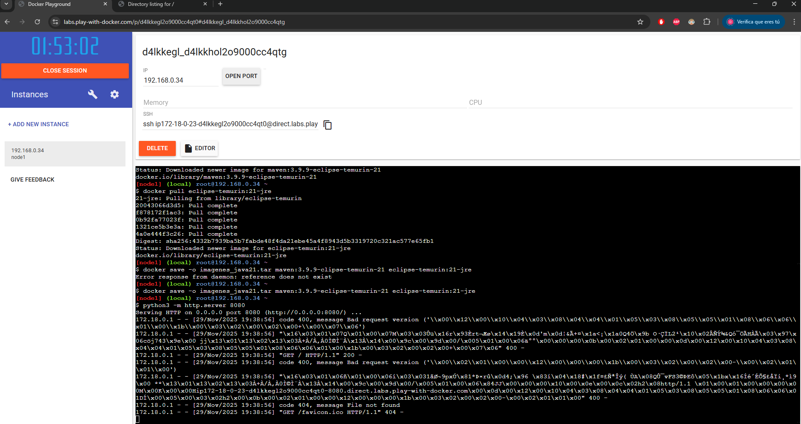
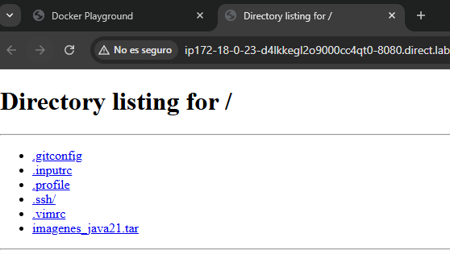
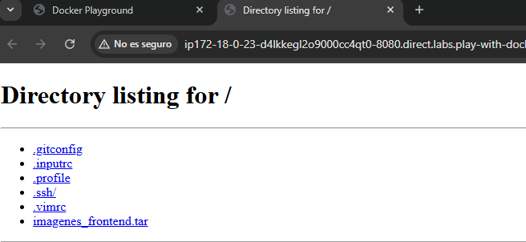
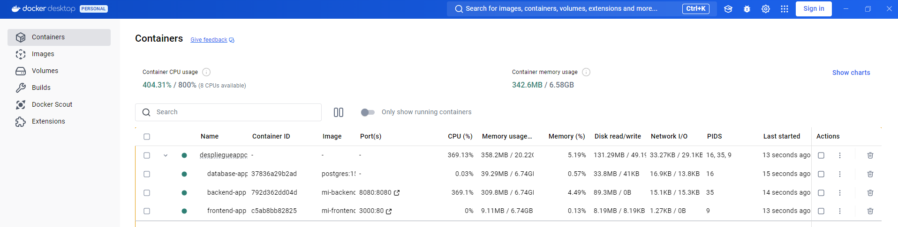
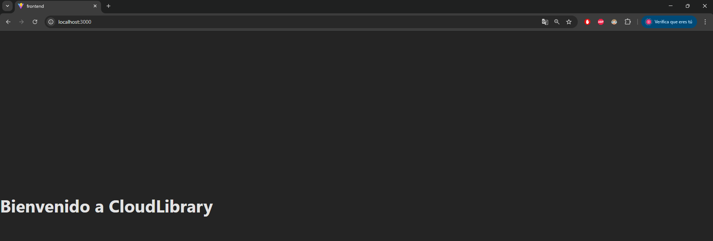
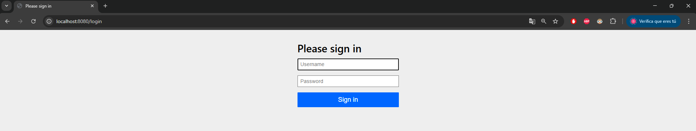
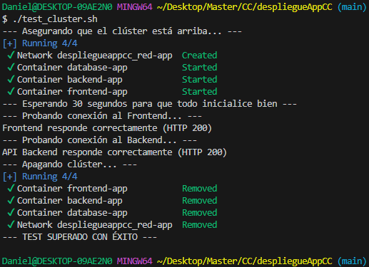
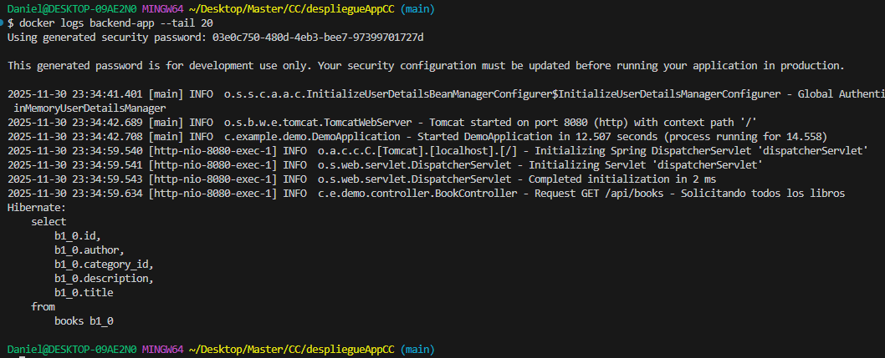

# Hito 4: Composición de servicios

## Estructura del Clúster de Contenedores

### Descripción de la Arquitectura

Para el Hito 4, se ha diseñado una arquitectura de microservicios contenerizada utilizando **Docker Compose**. Esta herramienta nos permite orquestar el despliegue de múltiples contenedores de forma simultánea, reproducible y aislada.

El clúster está compuesto por tres servicios fundamentales, cumpliendo con el requisito de separar la lógica, la presentación y los datos:
- **Capa de Datos (**`db`**):** Un contenedor dedicado exclusivamente al almacenamiento de información persistente.
- **Capa de Lógica (**`backend`**):** Un contenedor que ejecuta la aplicación Spring Boot (Java), encargada de la lógica de negocio y la comunicación con la base de datos.
- **Capa de Presentación (** `frontend`**):** Un contenedor que sirve la aplicación web (React) mediante un servidor web de alto rendimiento (Nginx).

### Diagrama de Red y Comunicación

Para garantizar la seguridad y el aislamiento, se ha definido una red interna de tipo `bridge` llamada `red-app`.
- **Aislamiento:** Los contenedores se comunican entre sí utilizando nombres de dominio internos (DNS de Docker) como `db` o `backend`. La base de datos no está expuesta directamente a internet, solo es accesible por el backend dentro de esta red privada.
- **Exposición de Puertos:** Únicamente se exponen al exterior (host) los puertos necesarios para el usuario:
    - Puerto `3000`: Para acceder a la aplicación web (Frontend).
    - Puerto `8080`: Para verificar el estado de la API (Backend).

### Persistencia de Datos

Se ha configurado un **Volumen de Docker** llamado `db_data` para poder cumplir con el requisito de contenido exclusivo de datos. Gracias a este volumen, el ciclo de vida de los datos se desacopla del ciclo de vida del contenedor: si el contenedor de la base de datos se destruye o actualiza, la información de los usuarios no se pierde.

## Configuración y Justificación de los Contenedores

### Desafío Técnico: Instalación "Air Gap" (Sideloading)

Durante el desarrollo de esta práctica, nos encontramos con un problema persistente de conectividad en el entorno local (Windows + WSL2), donde Docker era incapaz de descargar imágenes del registro oficial debido a conflictos de red/proxy.

Para solucionar esto y garantizar que el entorno fuera reproducible, opté por una estrategia de **"Sideloading" de imágenes:**
1. Utilicé el entorno en la nube **"Play with Docker"** (que dispone de alta conectividad) para descargar las imágenes base oficiales.
2. Exporté las imágenes a archivos `.tar` (`docker save`).
3. Transferí estos archivos al entorno local y los cargé manualmente (`docker load`).






### Configuración del Servicio de Base de Datos

- **Imagen Base:** `postgres:15`
- **Justificación:** Se ha elegido la imagen oficial de PostgreSQL versión 15 por ser una versión estable (LTS) y ampliamente soportada. Al usar la imagen oficial, garantizamos que el contenedor viene optimizado y seguro por defecto.
- **Configuración:** Se inyectan las credenciales (usuario, contraseña y nombre de BBDD) mediante variables de entorno en el fichero `compose.yaml`, lo que permite cambiar la configuración sin reconstruir la imagen.

### Configuración del Servicio Backend

- **Imagen Base:** `eclipse-temurin:21`
- **Justificación:**
    - Se ha seleccionado Eclipse Temurin por ser una distribución de OpenJDK certificada y de alto rendimiento.
    - Específicamente se usa la etiqueta `21-jre` (Java Runtime Environment) en lugar del JDK completo para la fase de ejecución. Esto reduce drásticamente el tamaño de la imagen final y mejora la seguridad al no incluir compiladores ni herramientas de desarrollo en el entorno de producción.
    - Se utiliza **Java 21** por ser la última versión LTS (Long Term Support) disponible, garantizando soporte a largo plazo.

### Configuración del Servicio Frontend

- **Imagen Base:** `nginx:alpine`
- **Justificación:**
    - Para servir el frontend se utiliza Nginx en lugar de un servidor de desarrollo de Node.js. Nginx es un servidor web profesional, diseñado para manejar alta concurrencia y servir archivos estáticos con mucha mayor eficiencia.
    - Se elige la versión `alpine` porque está basada en Alpine Linux, una distribución extremadamente ligera (aprox. 5MB), lo que resulta en un contenedor final muy pequeño, rápido de desplegar y con menor superficie de ataque.



## Documentación de los Dockerfiles

Para la construcción de las imágenes de los microservicios, se ha optado por una estrategia de **Multi-Stage Build** (Construcción en Etapas). Esta técnica es fundamental en entornos de producción porque permite disociar el entorno de compilación (que requiere muchas dependencias y herramientas pesadas) del entorno de ejecución final (que debe ser lo más ligero y seguro posible).

A continuación, se detalla la implementación técnica para cada servicio.

### Dockerfile del Backend (Java Spring Boot)
El objetivo es generar una imagen que contenga únicamente el JRE (Java Runtime Environment) y el archivo `.jar` compilado, desechando el código fuente y la herramienta Maven una vez finalizada la compilación.

**Código fuente del Dockerfile:**

```Dockerfile
FROM maven:3.9.9-eclipse-temurin-21 AS builder

WORKDIR /app

COPY pom.xml .
COPY src ./src

RUN mvn clean package -DskipTests

FROM eclipse-temurin:21-jre

WORKDIR /app

COPY --from=builder /app/target/*.jar app.jar

EXPOSE 8080

ENTRYPOINT ["java", "-jar", "app.jar"]
```

**Análisis de la implementación:**

- `AS builder:` Etiquetamos la primera fase. Aquí descargamos todas las dependencias de Maven y compilamos el código. Esta capa engorda mucho (cientos de MB), pero será descartada.
- `FROM eclipse-temurin:21:` Iniciamos la segunda fase desde cero. Esta imagen base pesa significativamente menos ya que no incluye herramientas de desarrollo (`javac`, `mvn`), reduciendo la superficie de ataque.
- `COPY --from=builder:` Esta es la instrucción crítica. Extraemos únicamente el archivo compilado (`.jar`) de la etapa anterior, dejando atrás todo el "ruido" de la compilación.

### Dockerfile del Frontend (React + Vite)

Para el frontend, el desafío es transformar una aplicación de desarrollo (que corre sobre Node.js) en un conjunto de archivos estáticos (HTML, CSS, JS) que puedan ser servidos por un servidor web de alto rendimiento.

**Código fuente del Dockerfile:**

```Dockerfile
FROM node:20-alpine AS builder

WORKDIR /app

COPY package.json package-lock.json ./

RUN npm ci

COPY . .

RUN npm run build

FROM nginx:alpine

COPY --from=builder /app/dist /usr/share/nginx/html

EXPOSE 80

CMD ["nginx", "-g", "daemon off;"]
```

**Análisis de la implementación:**
- `node:20-alpine`: Usamos la versión Alpine de Node para que incluso la fase de construcción sea rápida.
- `RUN npm run build`: Este comando (propio de Vite) toma todo el código React y lo "empaqueta" en archivos estáticos puros dentro de la carpeta `dist`.
- `nginx:alpine`: En producción, no ejecutamos Node.js. En su lugar, usamos Nginx, que consume una fracción de la memoria RAM y CPU que necesitaría un servidor Node, y es mucho más eficiente sirviendo contenido estático.
- `COPY --from=builder`: Transferimos la carpeta `dist` al directorio `/usr/share/nginx/html`, que es donde Nginx busca los archivos por defecto para servirlos al navegador.

## Publicación en GitHub Packages y Actualización Automática

Para garantizar la **Integración y Despliegue Continuo (CI/CD)**, se ha implementado un pipeline automatizado utilizando GitHub Actions. Este sistema permite que, cada vez que se actualiza el código fuente en el repositorio, se generen automáticamente las nuevas imágenes Docker y se publiquen en el registro de contenedores de GitHub (GitHub Container Registry - GHCR).

Esta automatización es importante para el proyecto, ya que asegura que la versión desplegada de los contenedores siempre corresponde con la última versión estable del código.

### Definición del Workflow

El flujo de trabajo se define en el fichero `.github/workflows/docker-publish.yml`. A continuación, se detallan los componentes clave de su configuración:

**Disparadores (Triggers):** El pipeline está configurado para ejecutarse automáticamente, pero de forma selectiva para no desperdiciar recursos:

```YAML
on:
  push:
    branches: [ "main", "master" ]
    paths:
      - 'backend/**'
      - 'frontend/**'
      - '.github/workflows/docker-publish.yml'
```

**Permisos y Entorno:** El trabajo (`job`) se ejecuta en una máquina virtual Linux (`ubuntu-latest`) proporcionada por GitHub. Se conceden permisos explícitos de escritura (`packages: write`) para permitir la subida de los artefactos al registro.

```YAML
jobs:
  build-and-push:
    runs-on: ubuntu-latest
    permissions:
      contents: read
      packages: write
```

### Pasos del Pipeline (Steps)
El proceso de construcción sigue una secuencia lógica de 3 fases principales:

1. **Checkout del Código:** Se utiliza la acción `actions/checkout@v4` para clonar el repositorio dentro del servidor de integración.

2. **Autenticación en el Registro (Login):** Para subir las imágenes de forma segura, nos autenticamos en `ghcr.io` utilizando el token automático de GitHub (`GITHUB_TOKEN`), evitando así tener que hardcodear contraseñas en el código.
```YAML
- name: Log in to the Container registry
        uses: docker/login-action@v3
        with:
          registry: ${{ env.REGISTRY }}
          username: ${{ github.actor }}
          password: ${{ secrets.GITHUB_TOKEN }}
```
3. **Construcción y Publicación (Build & Push):** Se utiliza la acción oficial `docker/build-push-action`. Esta acción es capaz de leer el `Dockerfile` de cada servicio, descargar las imágenes base necesarias (Maven, Node, Nginx, etc.) directamente desde la nube, compilar el proyecto y subir el resultado.

```YAML
- name: Build and push Backend image
        uses: docker/build-push-action@v5
        with:
          context: ./backend
          push: true
          tags: ${{ steps.meta-backend.outputs.tags }}
          labels: ${{ steps.meta-backend.outputs.labels }}
```

### Comprobación del flujo en GitHuvb Actions
Para comprobar que la implementación ha sido exitosa, se comprueba desde el GitHub Actions una vez se sube a GitHub:


## Documentación del Fichero de Composición (`compose.yaml`)
El fichero `compose.yaml` actúa como el orquestador de la infraestructura, definiendo cómo se crean, configuran y comunican los tres servicios del sistema. A continuación, se analiza la configuración técnica de cada componente y las decisiones de diseño adoptadas.

### Definición de Servicios
El archivo define tres servicios interconectados:

**A. Servicio de Base de Datos (** `db` **)**

```YAML
db:
    image: postgres:15
    container_name: database-app
    restart: always
    environment:
      POSTGRES_DB: mi_basedatos  
      POSTGRES_USER: postgres      
      POSTGRES_PASSWORD: postgres   
    volumes:
      - db_data:/var/lib/postgresql/data 
    networks:
      - red-app
```
- **Persistencia:** Se utiliza el volumen nombrado `db_data` montado en `/var/lib/postgresql/data`. Esto garantiza que los registros de la base de datos sobrevivan a reinicios o eliminaciones del contenedor.
- **Inicialización:** Las variables de entorno `POSTGRES_...` instruyen al contenedor para crear automáticamente la base de datos y el usuario al arrancar por primera vez.

**B. Servicio Backend (** `backend` **)**
```YAML
backend:
    image: mi-backend        
    container_name: backend-app
    restart: on-failure
    depends_on:
      - db                  
    environment:
      DB_HOST: db             
      DB_PORT: 5432
      DB_NAME: mi_basedatos  
      DB_USER: postgres       
      DB_PASSWORD: postgres   
    ports:
      - "8080:8080"    
    networks:
      - red-app 
```
- **Gestión de Dependencias:** La directiva `depends_on: - db` asegura que Docker intente arrancar la base de datos antes que el servidor de aplicaciones.
- **Configuración como Código (Factor Clave):** Este es el punto más crítico de la arquitectura.
    - En el código fuente Java (`application.properties`), la URL de conexión está parametrizada: `jdbc:postgresql://${DB_HOST:localhost}:...`.
    - En `compose.yaml`, inyectamos la variable de entorno `DB_HOST: db`.
    - **Resultado:** El contenedor backend utiliza el DNS interno de Docker para resolver el nombre `db` a la dirección IP interna del contenedor de PostgreSQL. Esto permite que el mismo código funcione en desarrollo (usando `localhost`) y en producción (usando `db`), cumpliendo el principio de portabilidad.

**C. Servicio Frontend (** `frontend` **)**

```YAML
frontend:
    image: mi-frontend      
    container_name: frontend-app
    restart: on-failure
    depends_on:
      - backend
    ports:
      - "3000:80"       
    networks:
      - red-app
```
- **Mapeo de Puertos:** Se mapea el puerto `3000` del host (máquina del usuario) al puerto `80` del contenedor (donde escucha Nginx). Esto permite acceder a la aplicación web mediante `http://localhost3000`.

### Redes y Aislamiento
```YAML
networks:
  red-app:
    driver: bridge
```
Todos los servicios se despliegan dentro de una red personalizada tipo `bridge` llamada `red-app`.

- **Seguridad:** Esta red aísla el tráfico de la aplicación. Contenedores externos o ajenos a esta red no pueden acceder a la base de datos ni al backend.
- **Descubrimiento de Servicios:** Docker proporciona resolución de nombres automática dentro de esta red, permitiendo que los contenedores se "llamen" por su nombre de servicio (`backend`, `db`) en lugar de por direcciones IP, que son volátiles.

## Validación del Clúster y Funcionamiento

### Verificación Visual y Manual del Estado del Clúster

Antes de ejecutar las pruebas automatizadas, se ha verificado manualmente que el despliegue ha sido exitoso mediante `docker compose up -d`.

**A. Estado de los Contenedores:** Como se muestra en la consola de Docker Desktop, los tres servicios (`database-app`, `backend-app`, `frontend-app`) se encuentran en estado de ejecución ("Running", indicadores verdes), consumiendo recursos y con los puertos 3000 y 8080 correctamente expuestos.



**B. Acceso a los Servicios Web:** Se ha comprobado el acceso desde el navegador del host a los puertos expuestos:

- **Frontend (** `http://localhost:3000` **):** La aplicación React carga correctamente, mostrando la página de bienvenida.



- **Backend (** `http://localhost:8080` **):** El servidor Tomcat de Spring Boot responde a las peticiones HTTP.



### Validación Automatizada: Script de Test

Para cumplir con el requisito de validar el correcto funcionamiento de la infraestructura orquestada, se ha implementado un script de automatización en Bash (`test_cluster.sh`). Este script actúa como una prueba de integración "end-to-end", verificando que los contenedores no solo arrancan, sino que son capaces de responder a peticiones HTTP en los puertos esperados.

```sh
#!/bin/bash

# 1. Arrancar el clúster en segundo plano
echo "--- Asegurando que el clúster está arriba... ---"
docker compose up -d

# 2. Esperar un poco por si acaso
echo "--- Esperando 30 segundos para que todo inicialice bien ---"
sleep 30

# 3. Probar el Frontend (Puerto 3000)
echo "--- Probando conexión al Frontend... ---"
STATUS_FRONT=$(curl -s -o /dev/null -w "%{http_code}" http://localhost:3000)

if [ "$STATUS_FRONT" == "200" ]; then
    echo "Frontend responde correctamente (HTTP 200)"
else
    echo "Frontend falló con estado $STATUS_FRONT"
    exit 1
fi

# 4. Probar el Backend (Puerto 8080) /api/books
echo "--- Probando conexión al Backend... ---"

STATUS_BACK=$(curl -s -o /dev/null -w "%{http_code}" http://localhost:8080/api/books)

if [[ "$STATUS_BACK" =~ ^(200|401)$ ]]; then
    echo "API Backend responde correctamente (HTTP $STATUS_BACK)"
else
    echo "Fallo en el Backend (Estado $STATUS_BACK)"
    docker logs backend-app
    exit 1
fi

echo "--- Apagando clúster... ---"
docker compose down

echo "--- TEST SUPERADO CON ÉXITO ---"
```

El script realiza una secuencia de operaciones controlada:
El script realiza una secuencia de operaciones controlada:
- **Arranque de Infraestructura:** Ejecuta `docker compose up -d` para desplegar los servicios definidos.
- **Espera Activa:** Incluye un comando `sleep` para permitir que el contenedor `backend` finalice la conexión JDBC con el contenedor `db` antes de recibir peticiones.
- **Verificación de Servicios (Health Checks):**
    - **Frontend (** `http://localhost:3000` **):** Se verifica que el servidor Nginx devuelva un código HTTP 200, confirmando que la aplicación React está siendo servida.
    - **Backend API (** `http://localhost:8080/api/books` **):**
        - Se realiza una petición `GET` al endpoint `/api/books` definido en el `BookController`.
        - Esta prueba es crítica porque valida la **cadena completa de conexión**: para responder a esta petición, el Backend debe estar activo y haber establecido conexión exitosa con la base de datos PostgreSQL.
        - Se considera éxito si se recibe un código **200 OK** (lista de libros) o **401 Unauthorized** (si la seguridad está activa), descartando errores de servidor (500) que indicarían fallos en la conexión a datos.
- **Limpieza:** Tras la validación, se apaga el clúster con `docker compose down`.

### Comprobación de ejecución
En la siguiente captura se muestra la ejecución exitosa del script. Se confirma que tanto la capa de presentación como la API REST del backend están operativas y respondiendo a través de la red interna de Docker.



### Verificación de Trazabilidad y Observabilidad
Además de la validación externa mediante códigos de estado HTTP, se ha verificado la **observabilidad interna** del clúster. La aplicación Spring Boot ha sido instrumentada utilizando `SLF4J` en los controladores REST.

Gracias a la arquitectura de Docker Compose, que redirecciona la salida estándar (`STDOUT`) de los contenedores a un log centralizado, podemos confirmar que la petición del script de test ha recorrido el flujo completo.

Como se observa en las siguientes líneas, tras la ejecución del test automatizado contra el endpoint `/api/books`, el contenedor `backend-app` registra dos eventos clave:

1. **Recepción de la petición en el Controlador:**

        INFO ... BookController - Request GET /api/books - Solicitando todos los libros

2. **Consulta a la Base de Datos (Persistencia):**

        Hibernate: select ... from books ...

Esto evidencia que la integración entre el **Script de Test -> Backend -> Base de Datos** es totalmente funcional y que la inyección de dependencias de Spring está operando correctamente dentro del contenedor.



Para poder visualizar los logs, se comentó de manera temporal el `docker compose down` del final del test de cluster para que los contenedores no desaparecieran y fuera posible contemplar los logs.
