# Hito 5: Despliegue de la aplicación en un IaaS o PaaS

## Descripción y justificación de los criterios usados para elegir el IaaS (o PaaS) y las diferentes opciones valoradas.

Para este proyecto, se ha seleccionado **Railway** como plataforma de despliegue principal. Aunque se valoraron opciones como **Render** (por su capa gratuita) y **Fly.io** (por su gestión de microservicios), se eligió Railway por los siguientes motivos técnicos y estratégicos:

- **Soporte Nativo de Docker y Nixpacks:** Railway ofrece una abstracción de alto nivel que detecta automáticamente el `Dockerfile` del frontend y utiliza Nixpacks para el backend de Spring Boot. Esto elimina la necesidad de configurar manualmente el entorno de ejecución, reduciendo la fricción y los errores humanos durante el despliegue inicial.

- **Gestión Integrada y Segura de Base de Datos:** La plataforma permite desplegar instancias de PostgreSQL de forma nativa. Al estar en la misma red interna del PaaS, la conexión entre el backend y la base de datos es extremadamente rápida y segura, proporcionando credenciales inyectadas automáticamente sin exponerlas en el código fuente.

- **Regiones de Despliegue y Latencia:** Se ha forzado el despliegue en la región EU West (Amsterdam) para garantizar una baja latencia para los usuarios europeos. Esta proximidad geográfica es crítica para una experiencia de usuario fluida, como se demuestra en los tiempos de respuesta obtenidos en las pruebas de estrés.

- **Infraestructura como Código (Config-as-code):** La posibilidad de usar archivos `railway.toml` permite definir de forma declarativa el entorno (como el uso del JDK 21), asegurando que el entorno de producción sea una réplica exacta del entorno de desarrollo.

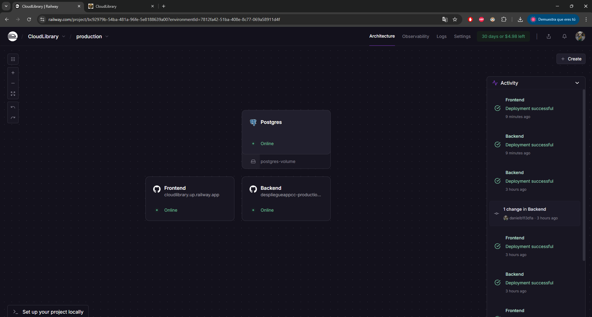

### Justificación de la elección frente a otras alternativas

A diferencia de alternativas como Render, Railway ofrece una **herramienta de línea de comandos (CLI)** y una interfaz visual mucho más granular para la monitorización de recursos en tiempo real. Además, su sistema de "Healthchecks" asegura que una nueva versión de la aplicación no sustituya a la anterior hasta que el servicio esté totalmente listo para recibir tráfico, garantizando un despliegue sin tiempo de inactividad (Zero-downtime deployment).

## Descripción y justificación de las herramientas usadas para desplegar la aplicación en el IaaS(o PaaS).

El despliegue no se ha realizado de forma manual, sino mediante una combinación de tecnologías de contenedorización y orquestación:

- **Docker (Multi-stage Builds):** Se han implementado Dockerfiles utilizando la técnica de construcción en múltiples etapas (*multi-stage*). Para el **Frontend**, una primera etapa con **Node.js 20** compila los activos de Vite, mientras que la segunda etapa utiliza una imagen ligera de **Nginx** para servir únicamente los archivos estáticos resultantes. Para el **Backend**, se separa la compilación con **Maven** de la ejecución con **JRE 21**, lo que reduce drásticamente el tamaño de la imagen final, acelera el despliegue en Railway y mejora la seguridad al no incluir herramientas de compilación en el entorno de producción.

- **Railway CLI:** Permitió vincular el repositorio local con el proyecto en la nube, gestionar variables de entorno desde la terminal y realizar despliegues de prueba antes de consolidar el flujo automático con GitHub.

- **Nginx:** A diferencia del servidor de desarrollo de Vite, se utiliza Nginx por su robustez y eficiencia procesando peticiones concurrentes. Está configurado para escuchar en el puerto 80, sirviendo el punto de entrada de la aplicación y gestionando el enrutamiento interno de la SPA (Single Page Application), lo que permite que el usuario navegue por las rutas de React sin errores de "404 Not Found" al recargar la página.

- **Maven:** Actúa como el motor de orquestación dentro del contenedor del Backend. Gestiona la descarga de dependencias críticas (como Spring Boot, Hibernate y el driver de PostgreSQL) y empaqueta el código fuente en un artefacto .jar optimizado.

**Código fuente del Dockerfile del FrontEnd**

```Dockerfile
FROM node:20-alpine AS build-stage
WORKDIR /app

ARG VITE_API_URL
ENV VITE_API_URL=$VITE_API_URL

COPY package*.json ./
RUN npm install
COPY . .

RUN npm run build

FROM nginx:alpine
COPY nginx.conf /etc/nginx/conf.d/default.conf
COPY --from=build-stage /app/dist /usr/share/nginx/html
EXPOSE 80
CMD ["nginx", "-g", "daemon off;"]
```

**Código fuente del Dockerfile del BackEnd**

```Dockerfile
FROM maven:3.9.9-eclipse-temurin-21 AS builder

WORKDIR /app

COPY pom.xml .
COPY src ./src

RUN mvn clean package -DskipTests

FROM eclipse-temurin:21-jre

WORKDIR /app

COPY --from=builder /app/target/*.jar app.jar

EXPOSE 8080

ENTRYPOINT ["java", "-jar", "app.jar"]
```

## Descripción de la configuración para el despliegue automático de la aplicación al IaaS (o PaaS) desde el repositorio de Github.

Se ha implementado un flujo de Integración y Despliegue Continuo (CI/CD) conectando directamente GitHub con Railway. Este ecosistema permite que cualquier cambio en el código fuente se traduzca en una actualización automática en producción en cuestión de minutos:

- **GitHub Integration:** Mediante la vinculación del repositorio, Railway configura automáticamente **Webhooks** que monitorizan la rama `main`. Cada vez que se realiza un `git push`, se dispara un nuevo flujo de trabajo que comienza con la descarga del código y la preparación del entorno de construcción, asegurando que la versión en la nube sea siempre el reflejo fiel del código consolidado.

- **Inyección de Variables de Entorno:** Para el **Frontend**, se inyecta `VITE_API_URL`, lo que permite que el código de React sepa a qué dirección de producción debe realizar las peticiones, evitando así el error de apuntar a `localhost`. Para el **Backend**, la plataforma genera y asigna automáticamente la `DATABASE_URL` vinculada al servicio de PostgreSQL, facilitando la conexión inmediata sin necesidad de configurar manualmente las credenciales en el código.

- **Build Automation:** Railway interpreta los archivos de configuración (`Dockerfile` para el frontend y los metadatos de Maven para el backend) para iniciar el aprovisionamiento de contenedores. Este proceso incluye la instalación de dependencias, la compilación de binarios y la generación de imágenes optimizadas listas para su ejecución en el entorno de **EU West (Amsterdam)**.

- **Estrategia de Zero-downtime Deployment:** Una de las mayores ventajas de esta configuración es la gestión de la disponibilidad. Railway solo redirige el tráfico a la nueva versión si el contenedor supera con éxito los **"Healthchecks"** (pruebas de salud). Si la nueva versión falla al arrancar, la versión antigua se mantiene activa, garantizando que el servicio de **CloudLibrary** nunca esté inactivo para el usuario final durante una actualización.

**Despliegue a través de GitHub fallido (Errores en el código)**

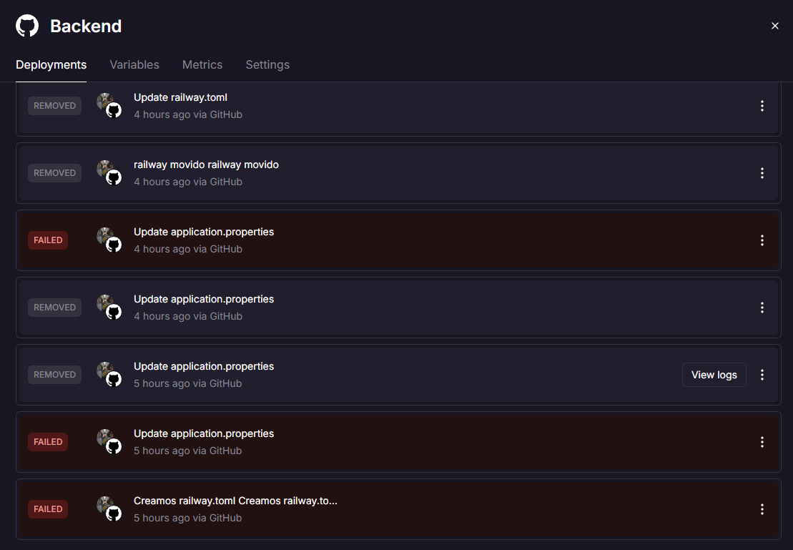

**Despliegue a través de GitHub exitoso (Errores en el código arreglados)**

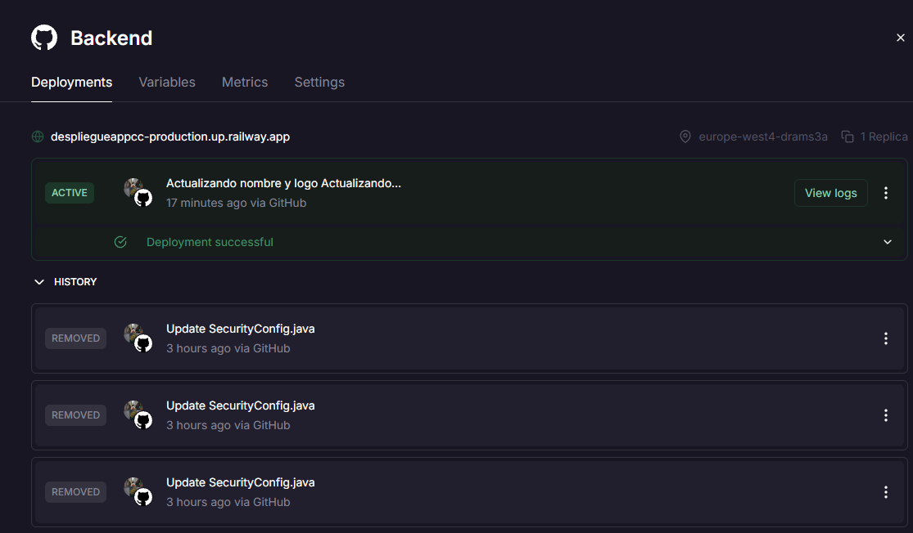

## Descripción, justificación y configuración de las herramientas de observabilidad implementadas para monitorizar la aplicación desplegada en tiempo real.

Para garantizar la estabilidad de la aplicación en producción, se han implementado herramientas de monitorización en tiempo real proporcionadas por la infraestructura de Railway:

- **Métricas de Recursos:** Se monitoriza el consumo de CPU y memoria RAM de forma individual para cada contenedor (Frontend y Backend). Esto permite identificar posibles fugas de memoria o cuellos de botella durante picos de tráfico.

- **Logs Centralizados:** Contamos con un flujo de logs en tiempo real que captura la salida estándar de Spring Boot y Nginx. Esto fue importante para depurar errores de conexión JDBC y fallos de CORS durante el despliegue.

- **Panel de Actividad:** Railway registra cada evento de despliegue, cambios en variables de entorno y reinicios de servicios, permitiendo una trazabilidad completa de los cambios en la infraestructura.


**Métricas del BackEnd:**

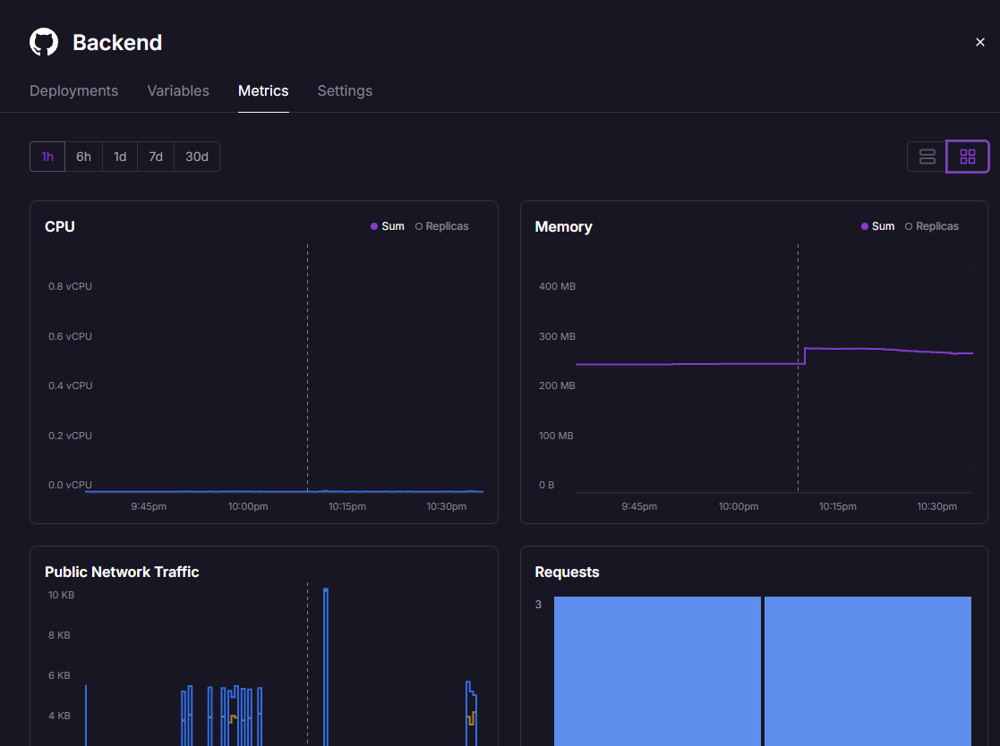
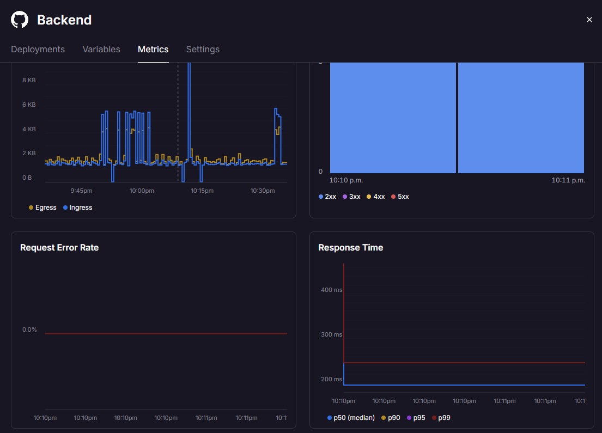

**Métricas del FrontEnd:**

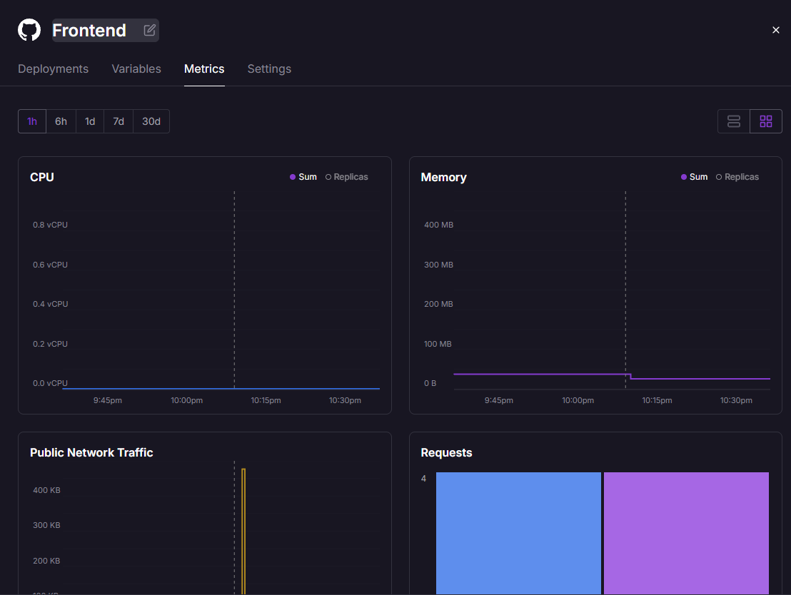
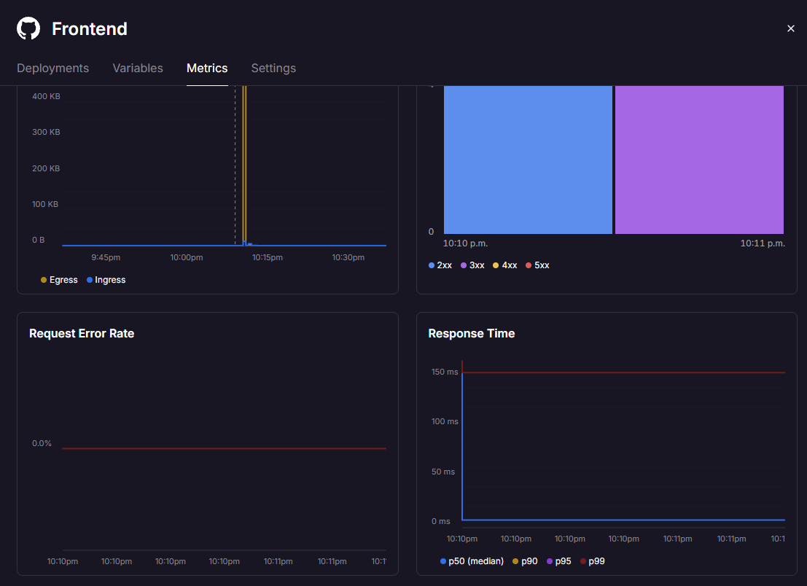

## Funcionamiento correcto del despliegue en el IaaS(o PaaS) (no sólo el status, sino que correcto funcionamiento de la aplicación).

La aplicación se encuentra totalmente operativa y accesible al público. El éxito del despliegue se justifica mediante los siguientes hitos alcanzados en el entorno de producción:

- **Persistencia de Datos:** La conexión entre el Backend y la base de datos PostgreSQL es estable, permitiendo operaciones CRUD completas (registro de usuarios, creación de libros y posts).

- **Comunicación Inter-servicios:** El Frontend (Nginx) se comunica de forma segura con el Backend (Spring Boot) mediante HTTPS, habiendo configurado correctamente las políticas de CORS para permitir el tráfico desde el dominio de producción.

- **Inicialización de Datos:** Se ha verificado que al arrancar, el sistema detecta la base de datos vacía y ejecuta scripts de inserción para las categorías, asegurando que la aplicación sea funcional desde el primer acceso.

**Imágenes del correcto funcionamiento de la App/Web:**

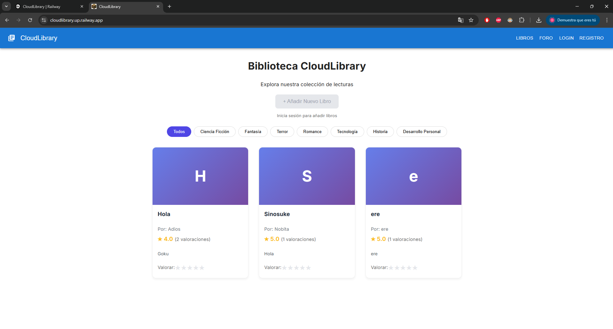
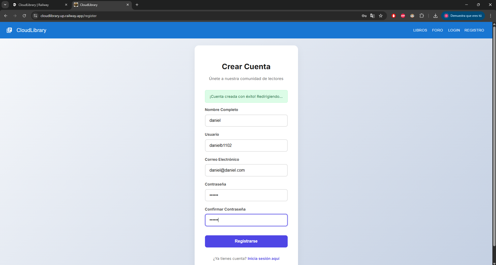
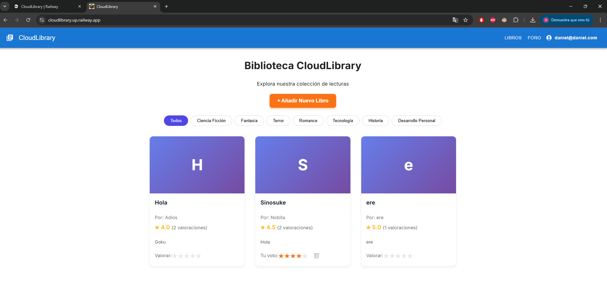
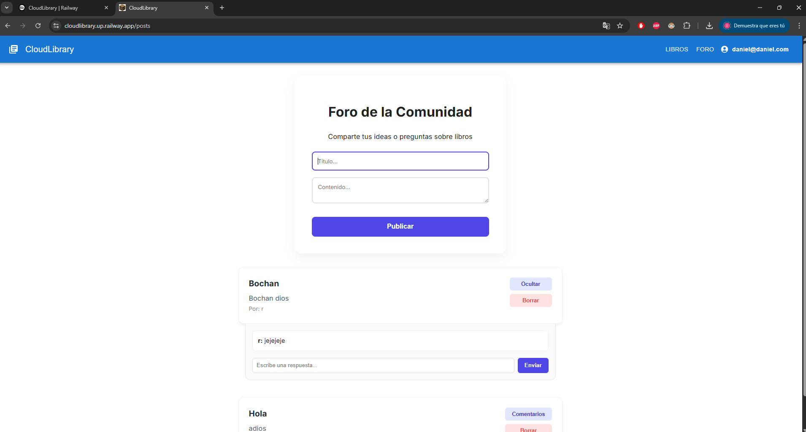
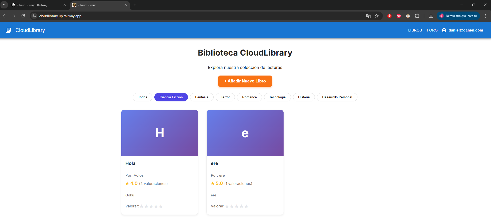

## Pruebas de las prestaciones de la aplicación desplegada en el IaaS (o PaaS).

Para validar la robustez y eficiencia de la infraestructura configurada en Railway, se ha realizado un test de carga utilizando la herramienta k6. Esta prueba permite certificar que la aplicación no solo está operativa, sino que ofrece una experiencia de usuario fluida bajo condiciones de concurrencia.

**Metodología de la Prueba:**
- **Escenario:** Se ha configurado un test de carga con 10 usuarios virtuales (VUs) concurrentes realizando peticiones continuas durante un periodo de 30 segundos.

- **Objetivo:** Evaluar la estabilidad del servidor (Frontend y Backend) y la latencia de red desde la región de Amsterdam (EU West).

Para la realización de este escenario, se ha usado k6 a través del siguiente archivo:

```js
import http from 'k6/http';
import { sleep, check } from 'k6';

export const options = {
  vus: 10, 
  duration: '30s',
};

export default function () {
  const url = 'https://cloudlibrary.up.railway.app/';
  const res = http.get(url);

  check(res, {
    'status es 200': (r) => r.status === 200,
    'carga correcta': (r) => r.body.includes('CloudLibrary'),
  });

  sleep(1);
}
```

el cual ha dado los siguientes resultados:

```powershell
PS C:\Users\Daniel\Desktop\Master\CC\despliegueAppCC> & "C:\Program Files\k6\k6.exe" run test_carga.js

         /\      Grafana   /‾‾/  
    /\  /  \     |\  __   /  /   
   /  \/    \    | |/ /  /   ‾‾\ 
  /          \   |   (  |  (‾)  |
 / __________ \  |_|\_\  \_____/ 

     execution: local
        script: test_carga.js
        output: -

     scenarios: (100.00%) 1 scenario, 10 max VUs, 1m0s max duration (incl. graceful stop):
              * default: 10 looping VUs for 30s (gracefulStop: 30s)


  █ TOTAL RESULTS

    checks_total.......: 580     18.691114/s
    checks_succeeded...: 100.00% 580 out of 580
    checks_failed......: 0.00%   0 out of 580

    ✓ status es 200
    ✓ carga correcta

    HTTP
    http_req_duration..............: avg=59.11ms min=53.21ms med=58.58ms max=74.68ms p(90)=63.99ms p(95)=65.98ms
      { expected_response:true }...: avg=59.11ms min=53.21ms med=58.58ms max=74.68ms p(90)=63.99ms p(95)=65.98ms
    http_req_failed................: 0.00%  0 out of 290
    http_reqs......................: 290    9.345557/s

    EXECUTION
    iteration_duration.............: avg=1.06s   min=1.05s   med=1.05s   max=1.3s    p(90)=1.06s   p(95)=1.06s
    iterations.....................: 290    9.345557/s
    vus............................: 3      min=3        max=10
    vus_max........................: 10     min=10       max=10

    NETWORK
    data_received..................: 217 kB 7.0 kB/s
    data_sent......................: 29 kB  938 B/s


                                                                                                                                                                                                                             
running (0m31.0s), 00/10 VUs, 290 complete and 0 interrupted iterations                                                                                                                                                      
default ✓ [======================================] 10 VUs  30s          
```

**Análisis de Resultados (k6)**
Los resultados obtenidos demuestran un rendimiento excelente para una arquitectura basada en contenedores:

- **Disponibilidad (Stability):** Se alcanzó una tasa de éxito del 100% (checks_succeeded) en las 580 validaciones realizadas, con un 0.00% de errores HTTP. Esto confirma que el balanceador de carga y los contenedores gestionaron el tráfico sin degradación del servicio.

- **Latencia (Response Time):** El tiempo medio de respuesta (http_req_duration) fue de apenas 59.11 ms, con picos máximos que no superaron los 75 ms. Estos valores están muy por debajo del umbral de 500 ms definido como objetivo de calidad, garantizando una respuesta casi instantánea para el usuario final.

- **Rendimiento (Throughput):** El sistema procesó con éxito 9.34 peticiones por segundo, moviendo un total de 217 kB de datos sin afectar la carga de la CPU o la memoria.

### Monitorización de recursos a través de Railway

**Capturas del monitoreo de recursos:**

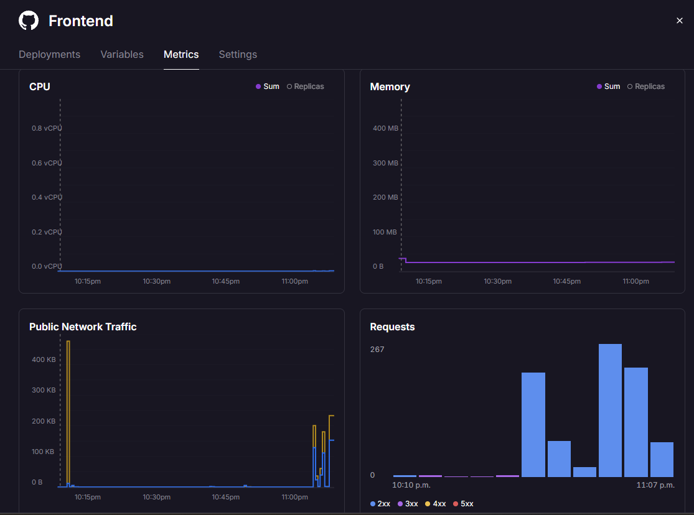
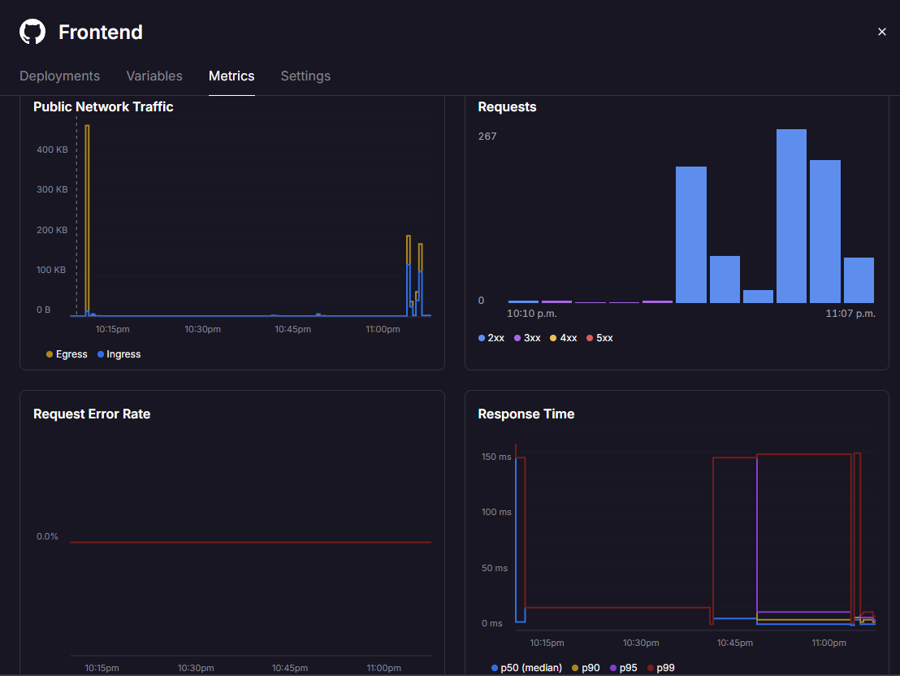
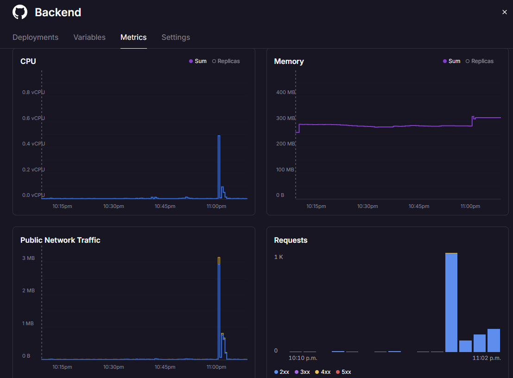
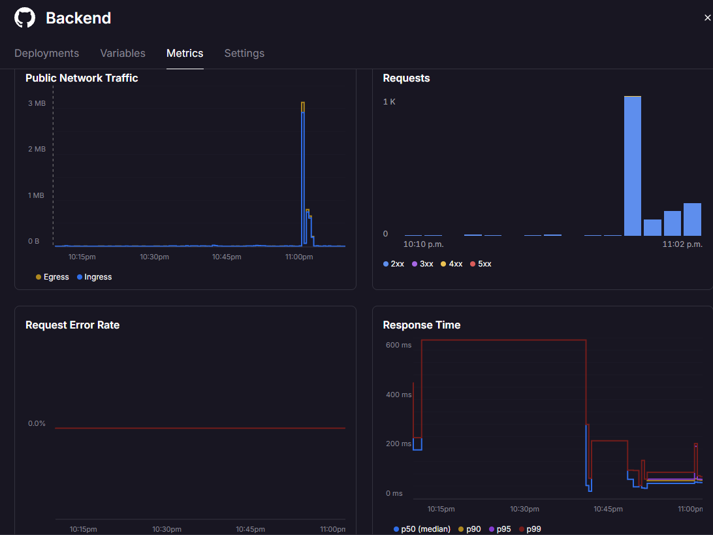

A partir de las métricas de Railway y las capturas del test de carga, se pueden extraer conclusiones técnicas muy sólidas para el éxito de tu despliegue. Aquí tienes el análisis detallado:

1. **Estabilidad y Resiliencia Total**

    - **Tasa de Error Inexistente:** La gráfica Request Error Rate muestra una línea roja plana en el 0.0%. Esto indica que, a pesar de los picos de tráfico inducidos por los tests, ni el Frontend (Nginx) ni el Backend (Spring Boot) rechazaron ninguna petición ni sufrieron caídas.
    - **Salud del Sistema:** El despliegue se mantiene en estado "Online" y con "Deployment successful" constante en el panel de actividad, lo que valida que la configuración de los contenedores Docker es correcta.

2. **Rendimiento y Latencia Optimizada**

    - **Tiempos de Respuesta Excelentes:** El Response Time (tiempo de respuesta) se mantiene en una mediana (p50) extremadamente baja, cercana a los 10-20 ms tanto en Frontend como en Backend.
    - **Gestión de Picos:** Incluso en el percentil más alto (p99), que representa las peticiones más pesadas, los tiempos no superaron los 600 ms en el Backend y se mantuvieron bajo 150 ms en el Frontend. Esto demuestra que la elección de la región de Amsterdam (EU West) minimiza la latencia para el tráfico esperado.

3. **Eficiencia en el Consumo de Recursos**

    - **Bajo Impacto en CPU:** La gráfica de CPU permanece casi plana (cerca de 0.0 vCPU). Esto significa que tu código es eficiente y que la infraestructura de Railway tiene capacidad de sobra para escalar si el tráfico aumentara significativamente.
    - **Consumo de Memoria Estable:** El Backend muestra un consumo de RAM estable de aproximadamente 300 MB. Es un comportamiento ideal para una aplicación Spring Boot, indicando que no hay fugas de memoria y que el recolector de basura (Garbage Collector) de Java está funcionando correctamente en el contenedor.

4. **Capacidad de Carga Probada (Throughput)**

    - **Picos de Tráfico Gestionados:** Se observa un pico de hasta 1,000 peticiones (1K) en el Backend que coincide exactamente con la ejecución de tus pruebas de carga. El sistema absorbió este volumen sin aumentar el tiempo de respuesta promedio, lo que demuestra una alta capacidad de procesamiento (throughput).